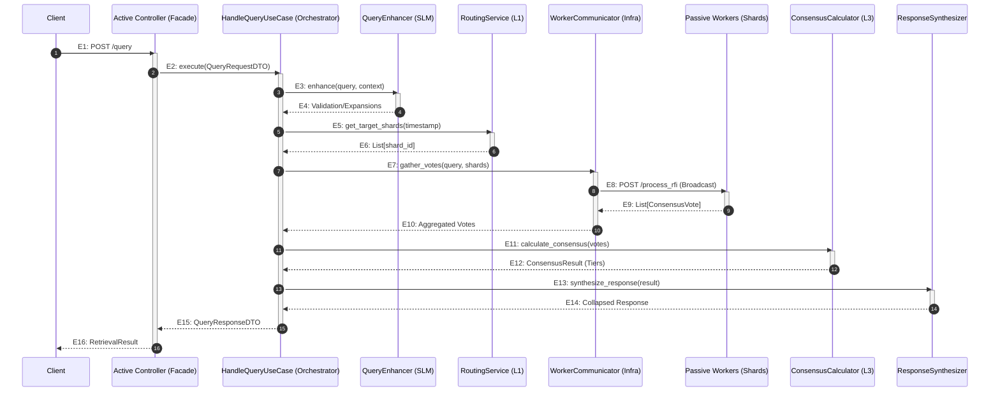

# Current State Runtime Sequence Diagram

## Diagram

## Legend

### Nodes (Components)
- **N1 Client**: The external user or system initiating the query.
- **N2 Active Controller (Facade)**: The FastAPI entry point (`active_agent.py`) that handles HTTP protocol details and delegates to the application layer.
- **N3 HandleQueryUseCase (Orchestrator)**: The core application logic (`handle_query_use_case.py`) that coordinates the DPR-RC pipeline steps.
- **N4 QueryEnhancer (SLM)**: The interface to the Small Language Model service used to refine and expand the raw query.
- **N5 RoutingService (L1)**: The domain service (`routing_service.py`) responsible for selecting relevant time shards based on the query timestamp.
- **N6 WorkerCommunicator (Infra)**: The infrastructure client (`worker_communicator.py`) that manages network communication with the distributed worker nodes.
- **N7 Passive Workers (Shards)**: The distributed worker instances holding the actual document shards and performing local retrieval.
- **N8 ConsensusCalculator (L3)**: The domain service (`consensus_calculator.py`) that executes the Resonant Consensus Protocol (RCP v4) equations.
- **N9 ResponseSynthesizer**: The domain service (`response_synthesizer.py`) that converts complex consensus states into a final user-facing answer.

### Edges (Interactions)
- **E1 POST /query**: The initial HTTP request containing the raw query text and timestamp context.
- **E2 execute(QueryRequestDTO)**: Passing the normalized request object into the business logic layer.
- **E3 enhance(query, context)**: Requesting the SLM to improve the query (e.g., adding synonyms, clarifying intent).
- **E4 Validation/Expansions**: Returning the "Enhanced Query" and any additional search terms.
- **E5 get_target_shards(timestamp)**: Asking the routing service which shards cover the relevant time period.
- **E6 List[shard_id]**: Returning the list of target shard identifiers (e.g., `shard_001_2015_2020`) based on simple date comparison.
- **E7 gather_votes(query, shards)**: commanding the infrastructure layer to contact the identified shards.
- **E8 POST /process_rfi (Broadcast)**: Sending the Request For Information (RFI) payload to the Passive Workers (via HTTP or Redis).
- **E9 List[ConsensusVote]**: The workers return their local findings as "Votes" (binary approval + snippets).
- **E10 Aggregated Votes**: The communicator collects all worker responses into a single list for processing.
- **E11 calculate_consensus(votes)**: Pushing the raw votes into the RCP v4 engine to determine truth/consensus.
- **E12 ConsensusResult (Tiers)**: Returning the artifacts classified into `Consensus`, `Polar`, or `Negative_Consensus` tiers.
- **E13 synthesize_response(result)**: Asking the synthesizer to format the consensus result into a readable final answer.
- **E14 Collapsed Response**: The final "Superposition State" and simple text answer.
- **E15 QueryResponseDTO**: Returning the complete domain object to the controller.
- **E16 RetrievalResult**: The final JSON HTTP response sent back to the client.
